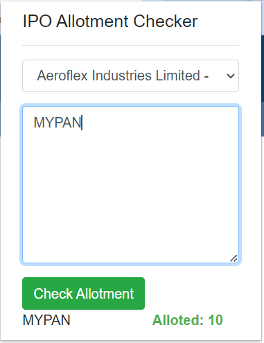
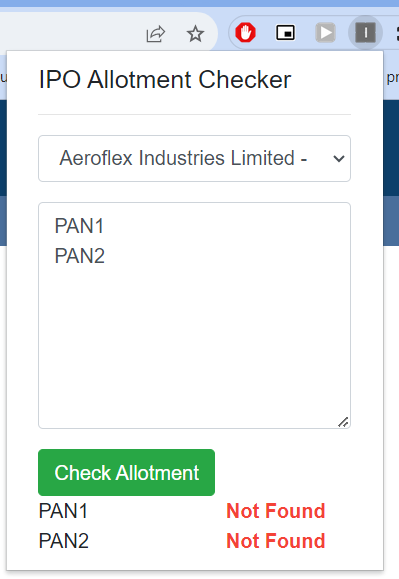
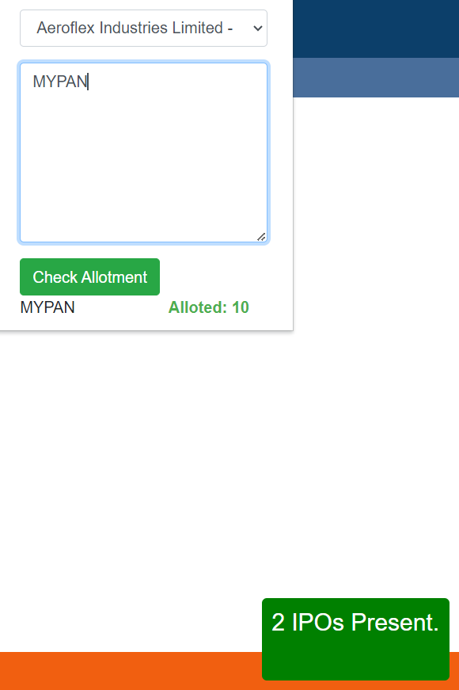

# IPOChecker
This Chrome extension is used to bulk IPO check on Link Intime website.
# Alloted status

# Not Alloted status

# Active IPO status
- As of now how may ipos are present in linkintime website.
- Same should be reflected in extenstion dropdown.
- Refresh page if not showing properly.

